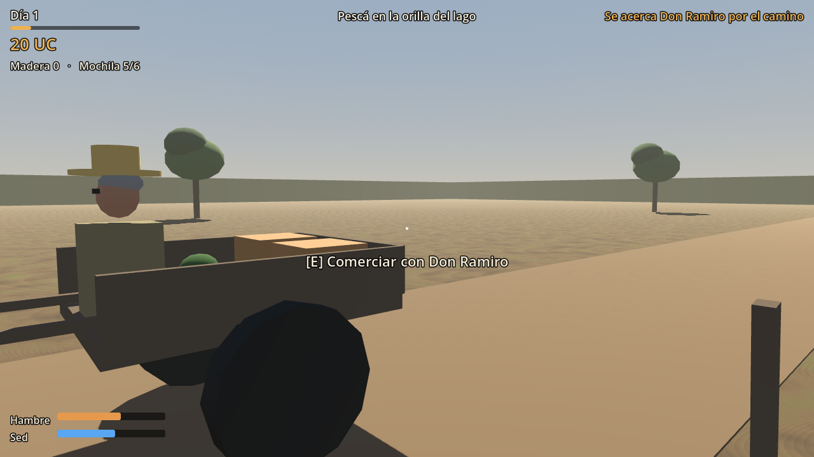

# Proyecto Presidente (nombre provisional)

Simulador en primera persona, para un jugador y sin conexión. Empezás sin nada: una carpa,
una fogatita, un lago y un camino de tierra. Pescás, les vendés a los comerciantes que pasan, juntás madera,
construís, y de a poco el lugar crece. Diseño en [`docs/DESIGN.md`](docs/DESIGN.md).

**Estado: "Carpa y lago" jugable** — pesca con skillcheck, hambre y sed, desmayo, comerciantes
con señas y en fila, madera, fogón con leña, clima y lluvia, herramientas que se gastan,
misterios antes de dormir, zorro y desconocido, espinel, bici, los tres locos en carpa (Beto,
Salim y Raúl) y la meta para fundar el pueblito. Detalle en [`docs/PROGRESS.md`](docs/PROGRESS.md).



## Versión y motor

| | |
|---|---|
| Motor | **Godot 4.7.2 estable** (`4.7.2.stable.official.ed1daf0bf`), edición estándar |
| Lenguaje | GDScript tipado |
| Renderer | Compatibility (`gl_compatibility`, OpenGL 3.3) |
| Plataforma objetivo | Windows x86_64 (teclado y mouse). Linux como validación secundaria |
| Plugins | ninguno |

Descarga oficial: <https://godotengine.org/download/archive/4.7.2-stable/>. Con otra versión
el proyecto puede abrir, pero solo se probó con 4.7.2.

## Cómo abrirlo y ejecutarlo

1. Abrí Godot 4.7.2 → **Importar** → elegí `project.godot` de esta carpeta.
2. La primera vez el editor importa los recursos (unos segundos).
3. **F5** (o el botón ▶) ejecuta la escena principal `scenes/main.tscn`.

Desde la terminal:

```sh
godot --path .                                   # jugar
godot --headless --path . --import               # importar recursos (primera vez / CI)
godot --headless --path . --script tests/run_tests.gd   # pruebas de dominio
godot --headless --path . res://tests/smoke_test.tscn   # prueba de humo de la escena
```

Ambas pruebas terminan solas y devuelven código distinto de cero si algo falla.

## Controles

| Tecla | Acción |
|---|---|
| W A S D | caminar |
| Shift | correr (4 → 6 m/s) |
| Mouse | mirar |
| E | interactuar: pescar, hacer señas, comerciar, juntar, construir, usar el fogón, charlar, dormir. En el skillcheck: apretar en la zona. En ramas, agua y espinel: mantener |
| Tab | mochila (comer, tomar, herramientas con sus usos, acopio y meta del pueblito) |
| Esc | pausa (guardar, cargar, ajustes) / cerrar panel / dejar de pescar o cancelar |
| F3 | diagnóstico (solo compilaciones de desarrollo) |

Las acciones están en el InputMap del proyecto (*Proyecto → Configuración → Mapa de entrada*).
Ajustes disponibles en la pausa: sensibilidad, invertir eje vertical, campo de visión
(65–100°, por defecto 80°) y volúmenes.

**Sobre el campo de visión:** el ajuste es un FOV **horizontal** medido sobre una pantalla 16:9.
La propiedad `Camera3D.fov` de Godot, con `keep_aspect = KEEP_HEIGHT` (valor por defecto), es el
FOV **vertical**; el juego convierte: 80° horizontales en 16:9 ≈ 49,4° verticales. En pantallas
más anchas se ve más a los costados, no menos arriba y abajo.

## Dónde guarda

- Partidas: `user://saves/` → en Windows `%APPDATA%\Godot\app_userdata\Proyecto Presidente\saves\`
  (`manual_1.json` + copia anterior `.bak`, `autosave.json` al cerrar cada día).
- Ajustes: `user://settings.cfg` (separado de las partidas).
- La ruta exacta aparece en el menú de pausa. Formato: [`docs/SAVE_SCHEMA.md`](docs/SAVE_SCHEMA.md).

## Exportar

Hay presets en `export_presets.cfg` ("Windows Desktop" y "Linux"). Para exportar hacen falta las
**plantillas de exportación de 4.7.2** (no incluidas; en este entorno no se instalaron):

1. Editor → *Editor → Administrar plantillas de exportación → Descargar e instalar* (4.7.2).
2. `godot --headless --path . --export-release "Windows Desktop" build/ProyectoPresidente.exe`

Todavía **no se generó ningún .exe**; la exportación es parte de H5.

## Estructura

```
project.godot, export_presets.cfg, default_bus_layout.tres
scripts/domain/        estado y reglas (sin SceneTree): dinero, tesorería, obras, cierre de jornada
scripts/application/   sesión (autoload "Game"), reloj, guardado, ajustes, diálogos
scripts/presentation/  jugador, interacción, mundo (kit de piezas, pozo, vecina) y UI
data/                  balance, objetos, comerciantes, construcciones, proyectos, diálogos y textos (CSV)
scenes/                main, jugador, actores, props y mundo (.tscn editables)
assets/                materiales, tema de UI, audio provisional generado
tests/                 pruebas de dominio, prueba de humo y fixture de guardado
tools/                 recorrido de capturas, generador de audio y de fixture
docs/                  progreso, decisiones y esquema de guardado
```

Todos los textos visibles están en `data/text/strings.csv` (columna `es`), listos para traducir.

## Recursos y licencias

- Geometría, materiales y sonidos: originales de este proyecto. Los sonidos se generan con
  `python3 tools/generate_audio.py` (solo biblioteca estándar).
- Godot Engine: licencia MIT. La fuente de la UI es la predeterminada del motor.
- No hay recursos de terceros ni paquetes comprados.

## Limitaciones conocidas

- La etapa del pueblito, la minería y los ayudantes vienen después (ver la hoja de ruta en `docs/PROGRESS.md`).
- Los vehículos de los comerciantes no tienen colisión.
- Balance sin ajustar con pruebas de juego: los números están en `data/`.
- Rendimiento **no verificado** en el hardware objetivo (ver `docs/PROGRESS.md`).
- Al cerrar el proceso Godot puede imprimir `1 resources still in use at exit` referido al audio
  ambiente. Es un aviso de apagado; no afecta partidas ni datos (ver PROGRESS).
